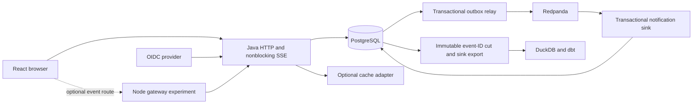

# Architecture

Auctionhouse is a Java/Spring modular monolith backed by PostgreSQL, with a React browser client. The same release image contains the application, migrations and built UI. The warehouse and experimental Node gateway are separate local processes. PostgreSQL is the authority for both auction state and application credential validity.

## Data and authority

| Component | Owned responsibility |
| --- | --- |
| Auction service/domain | Lifecycle, exact amounts, lock order, time checks and accepted state |
| Bid intents | Actor/auction/operation/key identity, digest, stable outcome and permanent reservation |
| Authentication | OIDC mapping, local roles, hashed opaque tokens, rotation and revocation |
| Outbox/notification | Atomic append, acknowledged relay progress, one effect per event and delivery attempts |
| Read cache | Versioned public detail snapshots and fallback; no bid authority |
| HTTP/SSE | Validated APIs, consistent snapshot cursor, bounded transport and current access checks |
| React | Accessible flows, durable pending intent and server-confirmed display state |
| Node gateway | Optional fan-out and transport recovery; authority remains upstream |
| Warehouse | Immutable raw grain, validation/quarantine, source-cut reconciliation and analytical models |
| Operations | Immutable delivery, migration/rollback boundary, health, telemetry and controlled experiments |

## Transaction boundary

A bid first validates the HTTP shape and authenticated actor, then starts the selected isolation strategy and locks its auction row. The service consults the scoped durable identity before evaluating current auction state. An identical retained request replays its outcome even after auction closure. A changed amount under the same identity conflicts. After 30 days the outcome API returns expiry, while the fingerprint remains reserved indefinitely.

For a new identity, the database clock is read after the row lock. The immutable domain model checks state, deadline, owner exclusion, amount range and increment. The transaction records an accepted or rejected outcome. Acceptance also inserts the bid, advances the auction version and appends the event before commit. Process-local single-flight reduces duplicate work; PostgreSQL locks and uniqueness protect correctness across processes.

READ COMMITTED uses explicit row locking. SERIALIZABLE uses the same row order and bounded whole-transaction retry. A durable rejection also advances the serialization dependency so competing snapshots cannot record inconsistent decisions. Exhaustion is a transient response, and a connection failure around commit remains ambiguous until the original identity is reconciled.

Publication atomically reserves the listing, records and activates its announcement, moves it to OPEN and appends its event. The scheduled closer uses the same locked domain transition as the owner's close endpoint. Draft and cancelled details remain owner-only. No payment or remote saga participates in these transactions.

## Authentication and browser recovery

Spring Security owns OIDC state/nonce/signature/issuer/audience validation and PKCE. The verified issuer/subject pair maps to a local account; roles come from the application database. Opaque application token hashes and revocation families are separate from provider tokens. Refresh serializes on the family, consumes the old identity and commits reuse revocation before returning an error.

Temporary OIDC/CSRF sessions use JDBC Spring Session. They cannot replace access-token validation. Cookie mutations require CSRF, and successful sign-in invalidates the temporary session. The browser coordinates refresh within and across tabs, rechecks the session inside the origin-wide lock, and preserves ambiguous bid identities. An expected-actor precondition prevents an old tab from submitting a retained intent as a newly signed-in account.

## Events and streams

Every auction change owns an immutable event UUID and a row-lock-serialized aggregate version. The Java event route uses Servlet asynchronous, nonblocking output. It admits a finite number of clients and bounds queued frames and bytes. It writes only when the container is ready, checks current auction visibility and raw token authority before each sensitive chunk, and closes stalled, expired or stale-authority clients. An independent watchdog can release capacity while a source/auth query is slow.

The browser starts from a state/cursor pair, applies only matching consecutive versions, ignores old/duplicate events and fetches a new snapshot after a gap. Connection recovery does not optimistically accept a bid. The Node experiment follows the same cursor contract and independently revalidates every downstream credential while sharing eligible upstream streams. Java remains the default; operational benefit requires a same-workload comparison after transport changes.

## Delivery and analytical cuts

The relay claims outbox rows with `SKIP LOCKED`, waits for broker acknowledgement and then records publication progress. Crashes can duplicate publication. Notification effect, deduplication and delivery-attempt metadata commit before consumer acknowledgement. Poison input is quarantined durably; infrastructure failures retry. A single local Redpanda replica is not a host-loss durability guarantee.

A repeatable-read PostgreSQL transaction captures an explicit immutable set of source event IDs. Warehouse reconciliation compares that membership with effects, distinguishing missing/pending identities, duplicate delivery attempts, duplicate effects and later out-of-cut events. No sequence maximum or equal row count substitutes for the identity set.

DuckDB retains one accepted raw event per ID and auction/version, and dbt builds actor/date/auction-version dimensions plus one-event facts. Rebuild uses a fresh database and verified retained raw envelopes; it never silently replaces the original. Accepted offer sums are activity measures, not revenue.

## Cache and deployment boundaries

Each public cache read obtains a PostgreSQL access/version stamp. Cache values must match that version and remain public; a fill racing cancellation cannot publish private state under an old shared key. memcached and Redis have actual local integration checks. The PageKV adapter has protocol fixtures; its real external server remains a separate integration requirement.

The release image uses a non-root process and read-only filesystem. Deployment separates migration authority from runtime DML privileges, verifies immutable artifacts, and rolls back application images only across an explicitly compatible schema. The AWS module and scripts encode ownership, identity/network controls and teardown interfaces; local container and mocked-provider tests do not establish an AWS deployment.

OpenTelemetry and the local collection stack have verified an asynchronous HTTP-to-sink trace, dashboard queries and alert firing/recovery. The seeded connection-pool comparison missed both load targets; its regression and shared-host limitations remain in the dated report. Real AWS delivery and negative tests, the full cloud topology, actual PageKV, and one-versus-two-host/load-balancer measurements remain required separate evidence. See [Deployment](DEPLOYMENT.md), [Load tests](LOAD-TEST.md) and the retained [Specification](SPEC.md).
